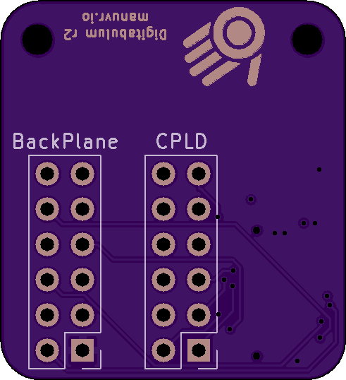
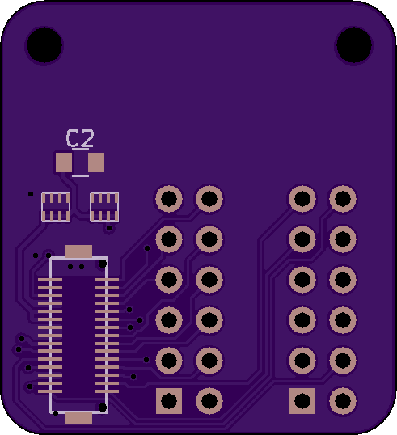

# Compute-Template

Provides a breakout to the compute/comm PCB connector on the r2-Backplane. It is also useful as a template for a custom Compute PCB.

## Intended usage

This project has two purposes:

 1) To be used as-is as a signal breakout for using Digitabulum _and_ the r2-Backplane with a new microcontroller without rolling a PCB for it.

 2) To be used as a template for a custom compute PCB to be attached to the r2-Backplane.

------------------------

Front | Back
:-------:|:------:
 | 

