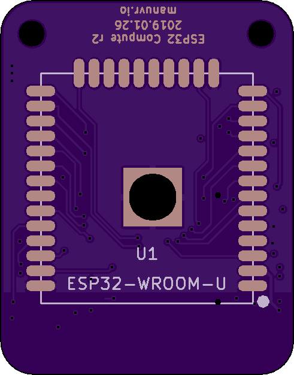
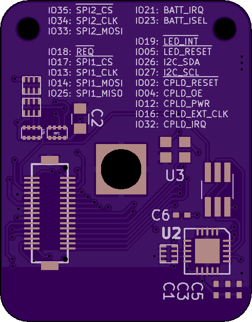

# Compute-WROOM32

This is one possible compute PCB to be used with Digitabulum-r2.

## Intended usage

This PCB, combined with a [backplane](../r2-Backplane), and a Digitabulum-r2 board (plus sensors) forms a complete electronics package for a single motion-capture glove.

## Features

* Integrated USB<-->Serial converter with Espressif monitor reset support.

## Attribution
This project uses [adamjvr's KiCAD library for the ESP32](https://github.com/adamjvr/ESP32-kiCAD-Footprints).

------------------------

Front | Back
:-------:|:------:
 | 

