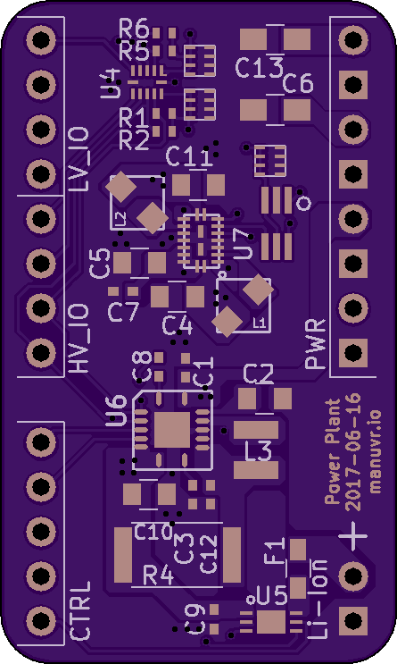
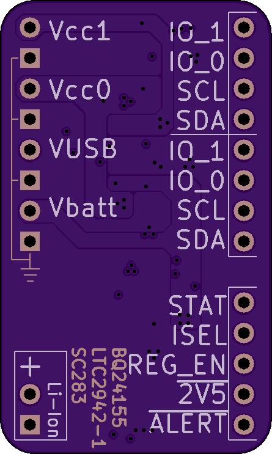

# Digitabulum-PowerPlant

This is the power-management block of Manuvr's motion-capture glove. It has been broken out as a module for testing and re-use. 

## Intended usage 
A software-mediated single-cell li-ion battery manager for cases needing bursts of a few watts and supporting long periods of quiescent standby.

## Features
* Fused battery
* Charger and fuel gauge are both i2c
* Secondary regulator has three voltages (0, 2.5, 3.3), and can be changed dynamically.
* Integrated 4-bit level-shifter (i2c capable)
* 2.54 headers
* Single-sided assembly for easy thermal-relief

## Primary components

Feature | Manufacturer | Part
|:----|-----:|
Battery charger | TI | BQ24155
Fuel gauge | Linear | LTC2942-1
Regulator | SEMTECH | SC283
Level-shifter | TI | LSF0204

## Constraints
* Battery must be li-ion chemistry.
* Primary regulator is always on and fixed at a 3.3v output.
* No single regulator may provide more than 1.8A, and the module's maximum output wattage is 4.2 watts. See below.

Charge and discharge rate on the battery must not exceed 1A, or the internal sense resistor in the fuel gauge will burn out. There is a resetable fuse to prevent damage, but this forms the limit on the module's practical output rating. However, the charger IC can handle up to a 20v input, and could conceivably draw more than the module's maximum output from the input source as it charges and powers the load. Fuse accordingly. :-)

------------------------

