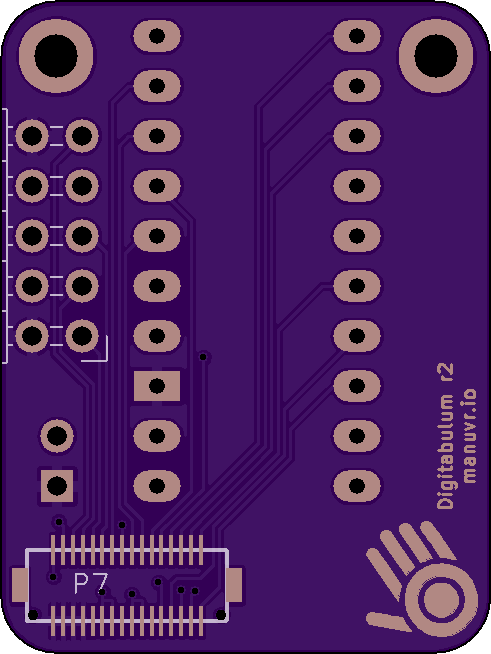
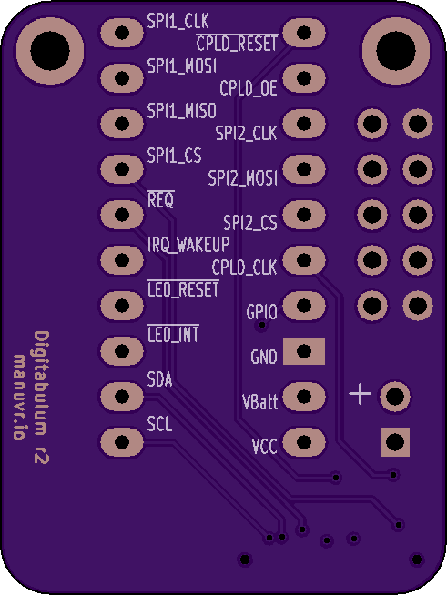

# r2-Adapter

This is a breadboard adapter for Digitabulum-r2. All signals are broken out and labeled.

## Intended usage

This project has two purposes:

 1) To be used as-is as a breadboard adapter and development tool.

 2) To be used as a template for a custom Digitabulum backplane.

## Features
* JTAG breakout
* 2.54 headers

------------------------

Front | Back
:-------:|:------:
 | 

