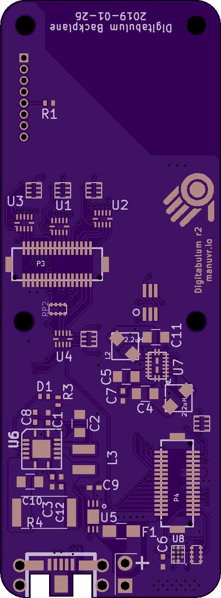

# r2-Backplane

This is a backplane PCB for Digitabulum containing the power-management block and associated support circuits.

## Intended usage

This PCB, combined with a Compute board, and a Digitabulum-r2 board (plus sensors) forms a complete electronics package for a single motion-capture glove.

The power-management block of this backplane is broken out in the [PowerPlant-Module](../PowerPlant-Module).

The CPLD GPIO pin has been routed to the 2v5/3v3 selection signal.

## Features
* ESD protection diodes for ingress-resistant USB port.
* Supports full software management of battery.
* Supports reduced-voltage operation and full power down of the sensor package for maximum battery longevity.
* JTAG breakout for in-circuit programming of CPLD.

------------------------

Front | Back
:-------:|:------:
 | 

