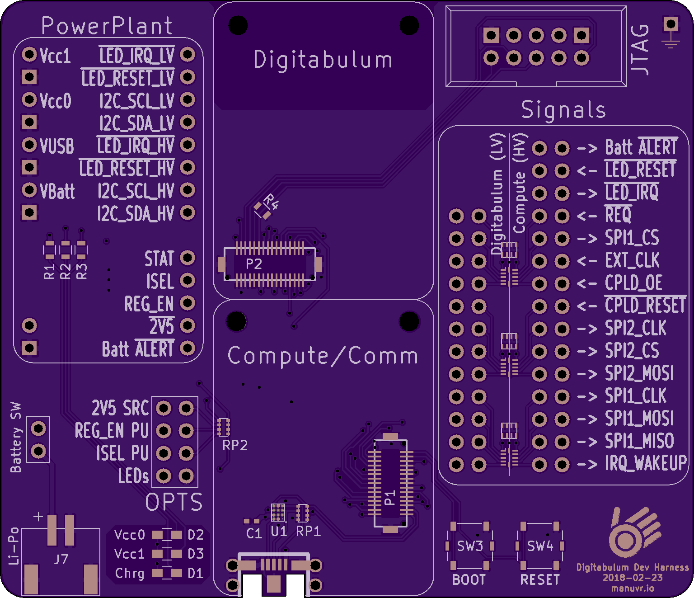
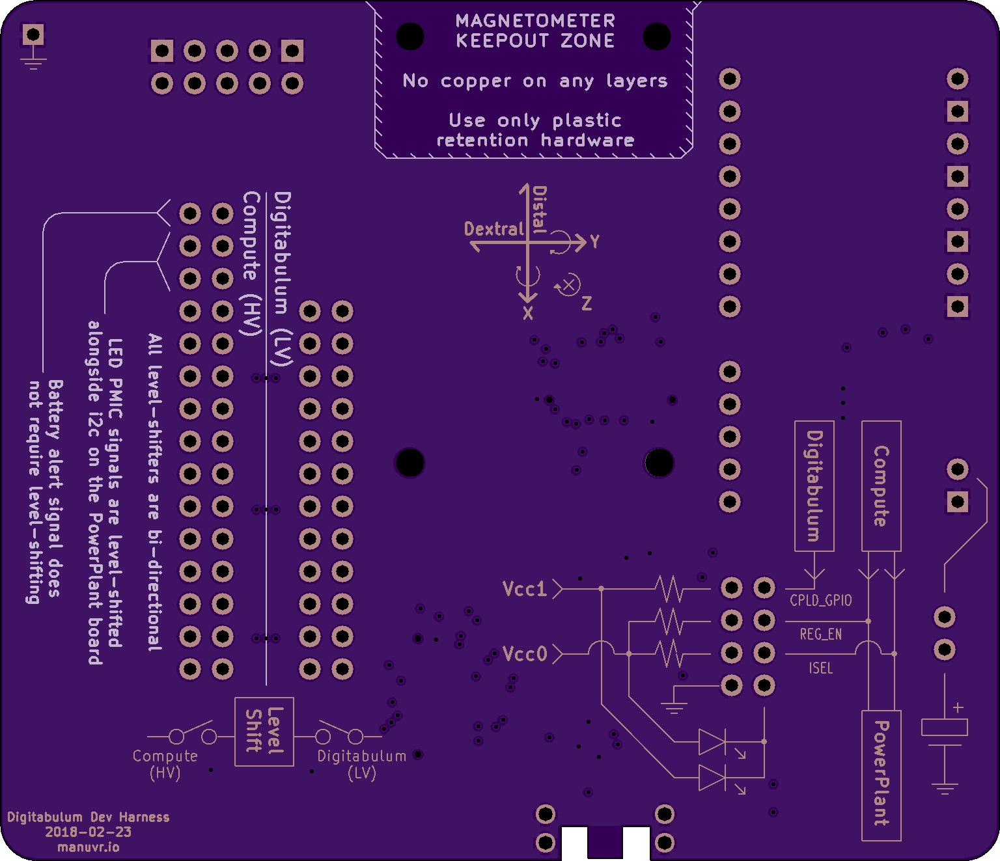

# r2-Dev-Backplane

This is a backplane PCB for Digitabulum. When combined with the [PowerPlant](../PowerPlant-Module), it has the same schematic as the [r2-Backplane](../r2-Backplane).

## Intended usage

This board is intended as a testing harness for functional subunits designed for use with the Digitabulum sensor package. This would be the board you would want for prototyping new CPLD designs, power supplies, or compute modules.

If you do not want to do those things, but just want a working glove, you should use the [r2-Backplane](../r2-Backplane) instead.

The CPLD GPIO pin has been routed to the 2v5/3v3 selection signal.

## Features
* ESD protection diodes for ingress-resistant USB port.
* Supports full software management of battery.
* Supports reduced-voltage operation and full power down of the sensor package for maximum battery longevity.
* JTAG breakout for in-circuit programming of CPLD.

------------------------

Front | Back
:-------:|:------:
 | 

